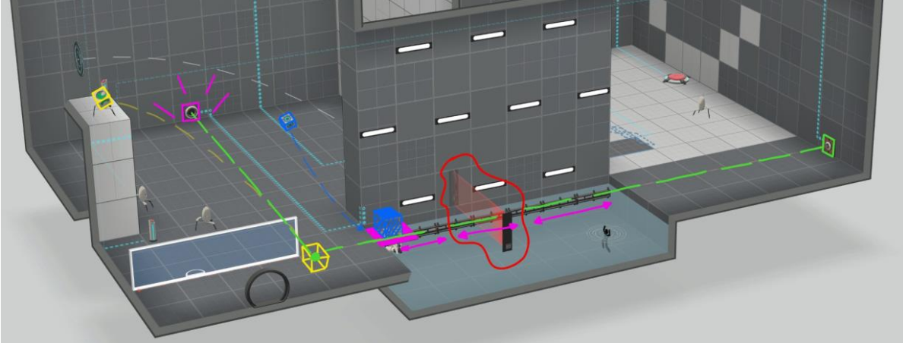

# Creative Level Design Document

## Description
This project showcases a custom level design for the game Portal 2, demonstrating creativity and technical skills in game and level design.

The document details a well-structured level that requires players to solve puzzles using portals, manage laser emitters, and navigate through challenging environments.

The design emphasizes strategic thinking and problem-solving, highlighting my ability to create engaging and immersive gameplay experiences.

This project reflects my capacity for creative level design and my understanding of game mechanics, making it a valuable addition to my portfolio.

## Documentation
For a detailed explanation of the level design and how it functions, please refer to the attached document in this GitHub repository. The document provides insights into the design process, the challenges faced, and how each puzzle and mechanic is intended to work within the level.

## Level Design Overview

